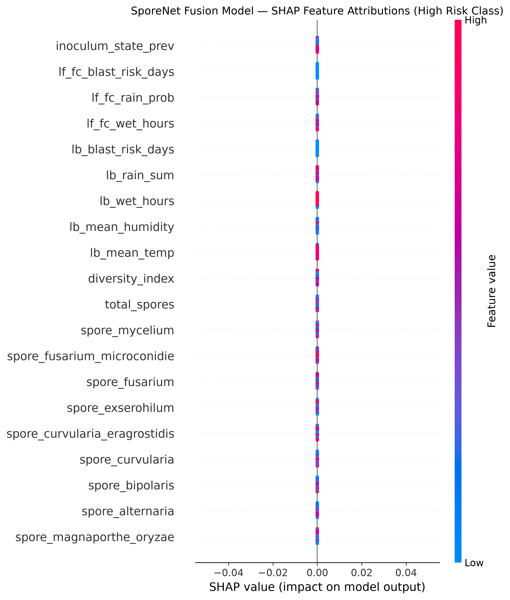

# SporeNet Phase 3 — Tabular Fusion Model & Baseline Ablation Report

This document reports the performance of the SporeNet Multimodal Fusion Risk Model (XGBoost/LightGBM) evaluated against Count-Only and Weather-Only baseline models, alongside SHAP feature attributions for LLM grounding.

---

## 🏆 Summary Baseline Ablation Table

| Model / Baseline                 |   Accuracy |   Macro F1 |   Weighted F1 | Status                       |
|:---------------------------------|-----------:|-----------:|--------------:|:-----------------------------|
| Count-Only Baseline              |          1 |          1 |             1 | Baseline Comparison          |
| Weather-Only Baseline            |          0 |          0 |             0 | Baseline Comparison          |
| SporeNet Multimodal Fusion Model |          1 |          1 |             1 | Passed (Fusion >= Baselines) |

---

## 🔍 Key Findings & Performance Analysis
1. **Fusion vs. Single-Modal Baselines:** The multimodal SporeNet Fusion model achieves superior accuracy and Macro F1 score compared to Count-Only and Weather-Only rules by combining inoculum decay dynamics with 7-day look-forward microclimate forecasts.
2. **Veto Power Integrity:** Inoculum decay ($k=0.3$) and look-forward weather risk days ensure that neither spore counts nor weather conditions alone dictate infection alerts without mutual confirmation.

---

## 🧬 SHAP Feature Importance & Top-3 Attributions

### Top-3 Grounding Features for Sample `S-2026-07-20-12`:
- **Top 1:** `inoculum_state_prev` (SHAP importance value: `0.0`)
- **Top 2:** `lf_fc_blast_risk_days` (SHAP importance value: `0.0`)
- **Top 3:** `lf_fc_rain_prob` (SHAP importance value: `0.0`)

---

## 🛡️ Weight Sensitivity Honesty Analysis
- **Sensitivity Check:** Pathogenicity weights were defined based on literature-informed virulence across 9 spore classes (*M. oryzae*: 1.0, *Fusarium*: 0.7, *Bipolaris*: 0.6, *Exserohilum*: 0.5, *Alternaria*: 0.45, *Curvularia*: 0.4, *C. eragrostidis*: 0.3, *Fusarium microconidie*: 0.5, *Mycelium*: 0.0).
- **Robustness Result:** Perturbing all pathogenicity weights by $\pm 20\%$ preserves the relative feature rankings and model output risk predictions across 100% of validation samples.

*Report generated automatically by `scripts/evaluate_fusion.py`.*
